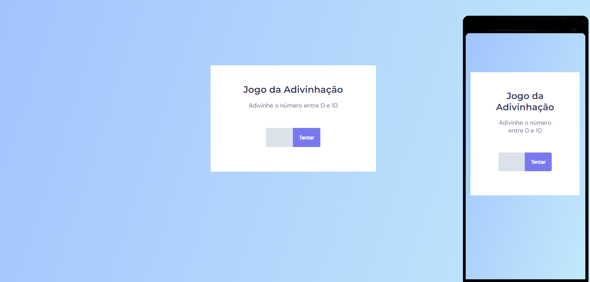

<h1 align="center"> Jogo da Adivinhação </h1>

Projeto promovido pela Rocketseat na trilha Explorer para ensino de tecnologias WEB, usando lógica de programação em JavaScript.

  <a href="#-tecnologias">Tecnologias</a>&nbsp;&nbsp;&nbsp;|&nbsp;&nbsp;&nbsp;
  <a href="#-projeto">Projeto</a>&nbsp;&nbsp;&nbsp;|&nbsp;&nbsp;&nbsp;
  <a href="#-layout">Layout</a>&nbsp;&nbsp;&nbsp;|&nbsp;&nbsp;&nbsp;
  <a href="#memo-licença">Licença</a>

  

 

## 🚀 Tecnologias

Esse projeto foi desenvolvido com as seguintes tecnologias:

- HTML e CSS
- Git e Github
- JavaScript
- Figma

## 💻 Projeto

Jogo da Adivinhação é um projeto WEB para fins de estudo de tecnologias WEB, trazendo tecnicas simples de Javascript, que tem como objetivo um jogo para que o usuário advinho um número randômico de 0 a 10, o jogo mostra o número de tentativas que o usuário praticou para obter o sucesso na adivinhação.

## 🔖 Layout

Você pode visualizar o layout do projeto através [DESSE LINK](<https://www.figma.com/file/Yow8sBG6oMd5j9ndeyQdJi/Jogo-Adivinha%C3%A7%C3%A3o-(Copy)?node-id=0%3A1&mode=dev>). É necessário ter conta no [Figma](https://figma.com) para acessá-lo.

## 📝 Licença

Esse projeto está sob a licença MIT.

---

Feito com ♥ by Rocketseat :wave: [Participe da nossa comunidade!](https://discord.gg/rocketseat)
